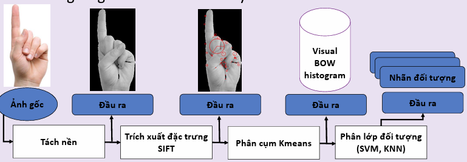
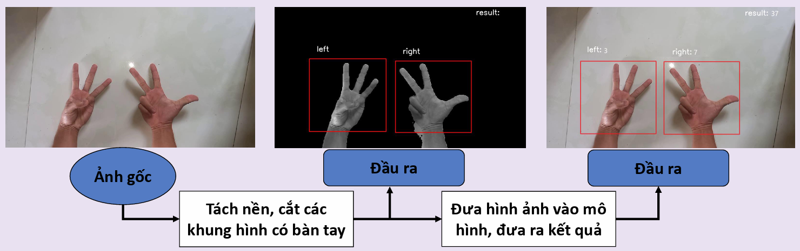
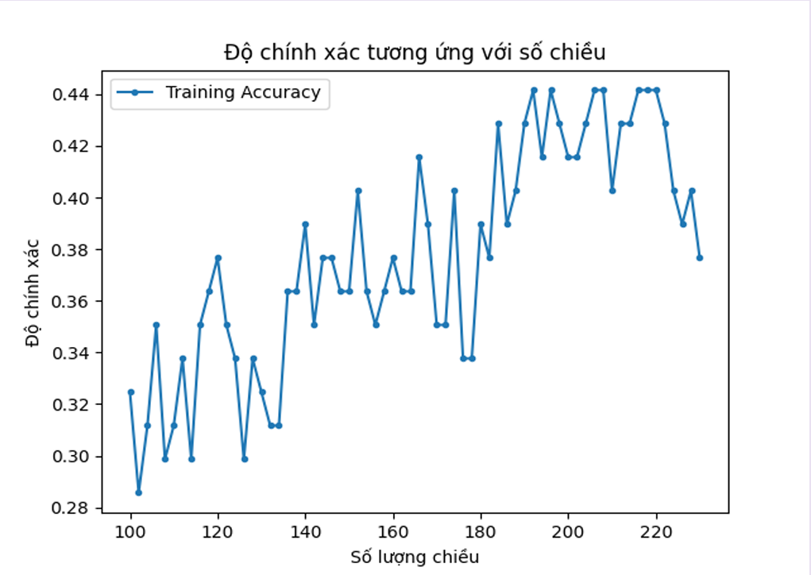

# Finger classifier with Bag Of Visual Word.
This project will aim to robust image classifier model tailored for short finger images, it's Bag of visual word.
## Abstract:

This project was create by Nguyen Luon Mong Do.
In this project, I will employ the Scale-Invariant Feature Transform (SIFT) for feature extraction, integrate it with K-Means clustering to construct a Bag of Visual Words (BoVW) framework. Subsequently, I will employ either the K-Nearest Neighbors (KNN) or Support Vector Machine (SVM) model for image classification.

## Installation

Clone this respository
```
    pip install https://github.com/SpiderMan-XiaoDo/bag-of-visual-word-finger-classifier.git
```
## Introduction

I will create the classifier model with the following workflow:
<p align="center">
  
</p>

After constructing the classifier model, create an application with the following workflow:

<p align="center">
  
</p>

## Dataset:

This dataset was created by me through collecting hand images from various students in the class. In total, there are 234 images used for the training set and 74 images used for evaluating the accuracy of the model.

## Result

Results of classification obtained with the KNN classification model:

| Number of Clusters | 100  | 200  | 300  | 500  | 1000 | 1600 | 2000 |
|---------------------|------|------|------|------|------|------|------|
| Accuracy            | 0.23 | 0.19 | 0.18 | 0.25 | 0.18 | 0.17 | 0.19 |


Results of classification obtained with the SVM classification model:

| Number of Clusters | 100  | 200  | 300  | 500  | 1000 | 1600 | 2000 |
|---------------------|------|------|------|------|------|------|------|
| Accuracy            | 0.182| 0.338| 0.260| 0.351| 0.361| 0.312| 0.377|

Results of classification obtained using the SVM classification model applying the PCA method:

<p align="center">
  
</p>

## References
[1] Abdellatif Hajraoui, Mohamed Sabri, “Face Detection Algorithm based on Skin.

[2] Object Recognition from Local Scale-Invariant Features, David G. Lowe.